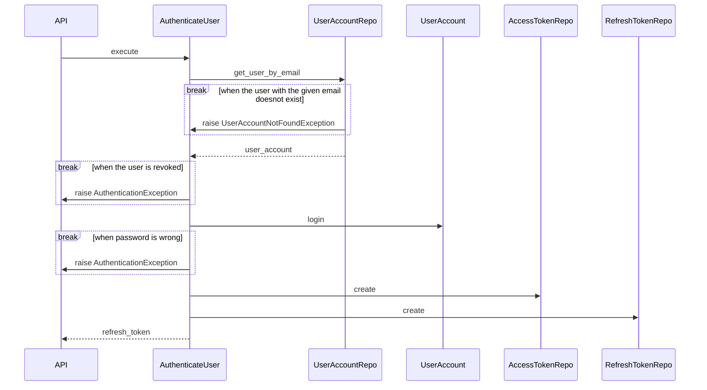

# Identity and Access Management module

## Authenticate User

Use case for authenticating a user. When a user is successfully authenticated this use case will return a refresh token. 

```mermaid
sequenceDiagram
    API->>AuthenticateUser: execute
    AuthenticateUser->>UserAccountRepo: get_user_by_email
    break when the user with the given email doesnot exist
        UserAccountRepo->>AuthenticateUser: raise UserAccountNotFoundException
    end
    UserAccountRepo-->>AuthenticateUser: user_account
    break when the user is revoked
        AuthenticateUser->>API: raise AuthenticationException
    end
    AuthenticateUser->>UserAccount: login
    break when password is wrong
        AuthenticateUser->>API: raise AuthenticationException
    end
    AuthenticateUser->>AccessTokenRepo: create
    AuthenticateUser->>RefreshTokenRepo: create
    AuthenticateUser-->>API: refresh_token
```
