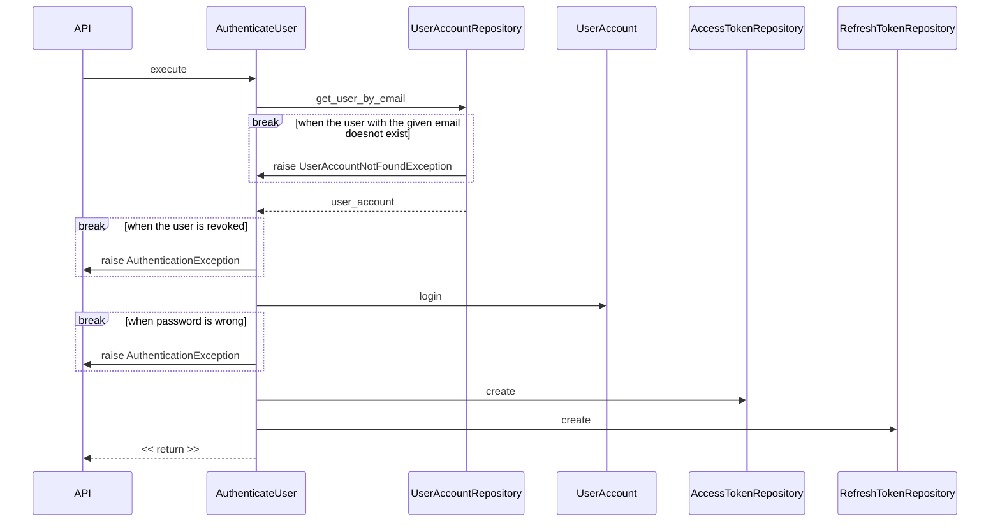
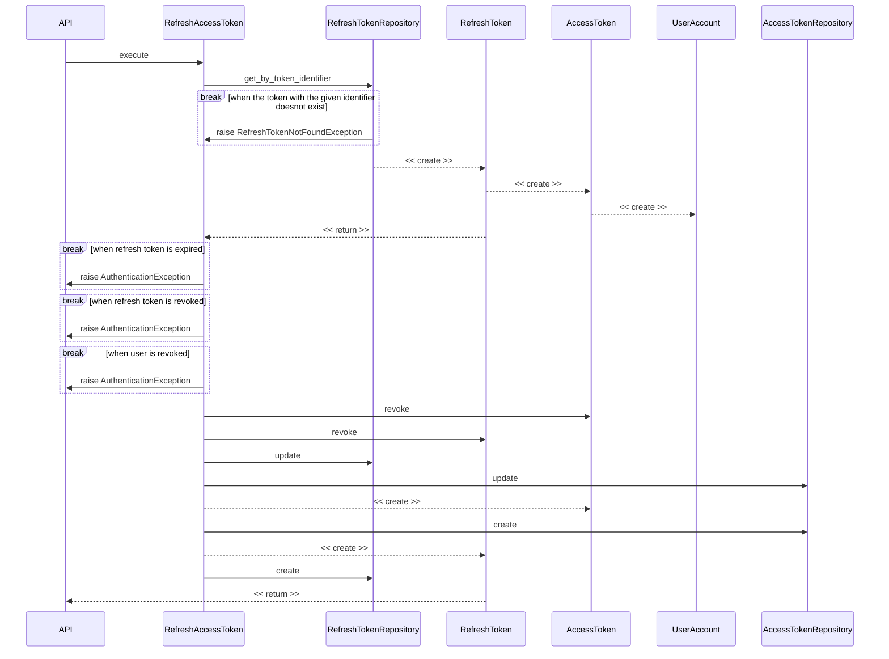

# Identity and Access Management module

## Authenticate User

Use case for authenticating a user. When a user is successfully authenticated this use case will return a refresh token. 

## Logout

## Mail User Recovery

## Recover User

## Refresh Token

Use case for refreshing the access token. On each request, also a new refresh token will be returned.

